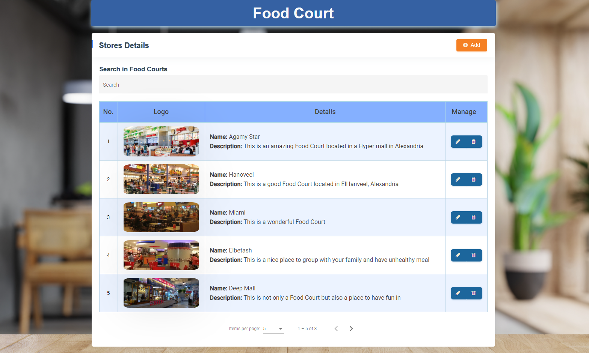

# Food Court Application
<p align="center">
  
</p>
</br>

To show the available Food Courts in a Dashboard where the Business owner can perform the CRUD operation to manage his business.

- ## Deployed on [netifly](https://foodcourtstores.netlify.app/)
## Features
- ### Performing the CRUD operation with a strict Template-driven validation on each entry in the create and  update operation.
</br>
<p align="center">
  
</p>
</br>

- ### Feedback message to the admin in creation - update - deletion of stores, informs the admin with the result of the operation (success - failed - duplication)
</br>
<p align="center">
  
</p>
</br>


- ### Dynamic Search for the stores by name, and propose suggestions in realtime from the backend with the pagination enabled.
</br>
<p align="center">
  
</p>
</br>

- ### Pagination on the request that is sent to the backend and in the table to limit the number of retrieved entries from the backend and for better UX. 

</br>

<p align="center">
  
</p>

## Libraries Highlights

- ### ```ng2-validation``` : To validate the Image URL input.
- ### ```Angular Material``` : I used Table - AutoComplete and Paginator components from the Angular Material Components.
- ### ```font-awesome , Bootstrap```


